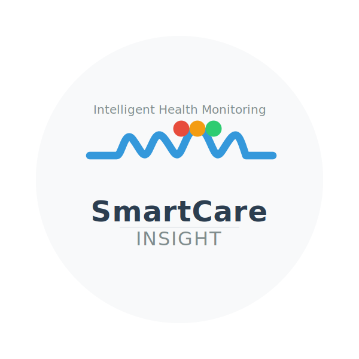

<div align="center">
  
  <h1 style="display: inline-block; vertical-align: middle; margin: 0 0 10px 0;">SmartCare Insight</h1>
  <p style="margin-bottom: 20px;">Intelligent Health Monitoring Platform</p>
</div>

[](https://opensource.org/licenses/Apache-2.0)
[](https://www.docker.com/)
[](https://www.python.org/)

## 🌐 Overview

**SmartCare Insight** is a comprehensive real-time health monitoring platform that demonstrates the practical application of advanced **Internet of Things (IoT)** and **Distributed Systems** concepts in a digital healthcare environment.

This system simulates a complete patient monitoring ecosystem, from wearable devices collecting biometric data to AI-powered predictive analytics, providing a scalable, real-time solution for continuous patient monitoring.

## 🎯 Objectives

### Primary
To provide an integrated real-time health monitoring solution that enables continuous and proactive patient monitoring, improving care quality and enabling early interventions.

### Additional Objectives
1. Demonstrate IoT concepts in biometric data collection and processing
2. Illustrate distributed systems architecture in a digital healthcare scenario
3. Showcase the integration of multiple components (devices, data processing, AI) in a real-time data pipeline
4. Provide a foundation for exploring emerging digital health technologies

## 🚀 Key Features

- **Real-time Monitoring**: Continuous collection and processing of vital signs
- **Distributed Architecture**: Containerized microservices that scale on demand
- **AI-Powered Analysis**: Advanced data processing using language models
- **Intelligent Alerting**: Proactive anomaly detection and contextual alerts
- **Scalable Pipeline**: MQTT-based messaging with InfluxDB storage
- **Interactive Dashboard**: Real-time data visualization and trend analysis
- **RESTful API**: Comprehensive interface for system integration
- **Multi-level Security**: Authentication, authorization, and encryption

## 🏥 Use Cases

### Patient Monitoring
Monitor patients in various settings with real-time alerts for abnormal values.

**Supported Monitoring Scenarios:**
- **Hospital Inpatient Monitoring**
  - Track vital signs of hospitalized patients
  - Monitor post-operative recovery
  - Track ICU patients with critical conditions
  
- **Home Care**
  - Remote monitoring of chronic conditions (hypertension, diabetes, etc.)
  - Post-discharge follow-up
  - Elderly care and fall detection
  
- **Clinical Research**
  - Collect longitudinal health data
  - Monitor clinical trial participants
  - Track treatment effectiveness

**Example Workflow:**
1. Patient wears monitoring device (in hospital, at home, or in clinic)
2. System continuously collects and analyzes health data
3. AI detects anomalies and generates contextual alerts
4. Healthcare providers receive real-time notifications
5. Proactive interventions are initiated based on data insights

### Clinical Research
Ideal for studies requiring continuous physiological data collection with real-time analysis.

### Remote Patient Monitoring
Enables post-hospitalization monitoring at home, reducing costs and improving comfort.

## 🚀 Quick Start

### Prerequisites
- Docker 20.10+
- Docker Compose 2.0+
- OpenAI API key (for LLM features)

### Installation
1. Clone the repository:
   ```bash
   git clone https://github.com/lehdermann/smartcare-insight.git
   cd smartcare-insight
   ```

2. Configure environment:
   ```bash
   cp .env.example .env
   # Add your OpenAI API key to .env
   ```

3. Start the system:
   ```bash
   docker-compose up -d
   ```

4. Access the dashboard: http://localhost:8501

## 🏗️ System Architecture

### Architecture Overview
Microservices-based architecture with independent Docker containers communicating via REST APIs and MQTT messaging.

**Key Principles:**
- **Decoupling**: Independent components with well-defined interfaces
- **Scalability**: Individual component scaling
- **Resilience**: Fault tolerance
- **Performance**: Parallel processing

### Component Details

#### Wearable Simulator
- Generates realistic biometric data (heart rate, blood pressure, etc.)
- Advanced physiological modeling:
  - Circadian rhythms
  - Meal effects on glucose
  - Sleep patterns
  - Medical condition simulations

#### Data Processor
- Validates and processes incoming data
- Stores data in InfluxDB time-series database

#### Alert Manager
- Monitors for anomalies
- Generates alerts based on configurable thresholds

#### LLM Service
AI-powered analysis with four types:
1. Time Window Analysis
2. Event-Based Analysis
3. Comparative Analysis
4. Trend Analysis

#### API Server
RESTful endpoints for:
- Patient management
- Data retrieval
- Alert management
- Authentication

#### Dashboard
Streamlit-based web interface for monitoring and analysis.

### Data Flow
1. **Collection**: Wearables → MQTT
2. **Processing**: Data validation → Storage
3. **Analysis**: Pattern detection → Insights
4. **Presentation**: Dashboard visualization

## ⚙️ Configuration

For detailed configuration instructions, please refer to the [Configuration Guide](docs/CONFIGURATION.md).

### Quick Setup

1. Copy the example environment file:
   ```bash
   cp .env.example .env
   ```

2. Update the configuration in `.env` as needed

3. Start the services:
   ```bash
   docker-compose up -d
   ```

### Key Configuration Areas

- **Wearable Simulator**: Control patient simulation parameters
- **MQTT Broker**: Configure message broker settings
- **InfluxDB**: Database and retention policies
- **API Server**: Authentication and CORS settings
- **LLM Service**: AI model configuration

See the [Configuration Guide](docs/CONFIGURATION.md) for all available options and advanced setup.

## 🛠 Development

### Setup
1. Clone and create virtual environment:
   ```bash
   python -m venv venv
   source venv/bin/activate  # Windows: .\venv\Scripts\activate
   pip install -r requirements-dev.txt
   ```

2. Start services:
   ```bash
   docker-compose up -d mosquitto influxdb
   ```

3. Run components:
   ```bash
   # In separate terminals
   python -m src.wearable_simulator
   python -m src.data_processor
   python -m src.alert_manager
   python -m src.llm_service
   python -m src.api_server
   streamlit run src/dashboard/app.py
   ```

### Project Structure
```
smartcare-insight/
├── src/
│   ├── api_server/         # REST API
│   ├── data_processor/     # Data processing
│   ├── alert_manager/      # Alert system
│   ├── llm_service/        # AI analysis
│   ├── dashboard/          # Web UI
│   └── wearable_simulator/ # IoT simulator
├── tests/                  # Tests
├── docker/                 # Docker configs
├── docs/                   # Documentation
├── .env.example            # Env vars
└── docker-compose.yml      # Container setup
```

## 📚 Documentation

- [System Architecture](docs/architecture.md) - High-level system design and component interactions
- [User Guide](docs/userguide.md)
- [API Documentation](http://localhost:8001/docs)
- [Alert Manager Documentation](src/alert-manager/README.md)
- [API Server Documentation](src/api-server/README.md)
- [Dashboard Documentation](src/dashboard/README.md)
- [Data Processor Documentation](src/data-processor/README.md)
- [LLM Service Documentation](src/llm-service/README.md)
- [Wearable Simulator Documentation](src/wearable-simulator/README.md)

## 🤝 Contributing

1. Fork the repository
2. Create a feature branch (`git checkout -b feature/amazing-feature`)
3. Commit your changes (`git commit -m 'Add amazing feature'`)
4. Push to the branch (`git push origin feature/amazing-feature`)
5. Open a Pull Request

## 📜 License

This project is licensed under the Apache License 2.0 - see the [LICENSE](LICENSE) file for details.

### Additional Terms and Conditions

- The "SmartCare Insight" name and logo are trademarks of the original author(s).
- You may not use the "SmartCare Insight" name, logo, or branding in a way that suggests your project is endorsed by or affiliated with the original authors without explicit written permission.
- For commercial use or distribution beyond the terms of the Apache License 2.0, please contact the copyright holders for additional licensing options.

## 📞 Support

For support, please open an issue in the repository or contact the maintainers.

## 🙏 Acknowledgments

- The open-source community
- Healthcare professionals
- Contributing developers

