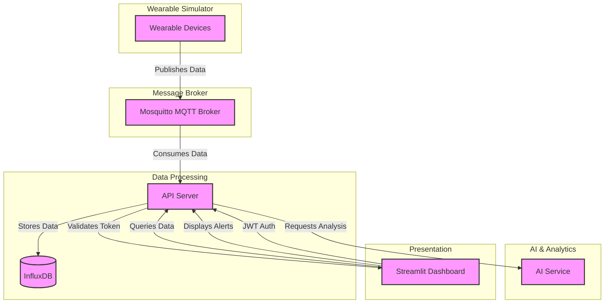

# SmartCare Insight - System Architecture

## 1. Overview

SmartCare Insight follows a microservices architecture with clear separation of concerns. The system is containerized using Docker and orchestrated with Docker Compose for easy deployment and scalability. This document provides a comprehensive view of the system's architecture, components, and their interactions.

### 1.1 Service Ports

| Service | Port | Description |
|---------|------|-------------|
| Dashboard | 8501 | Web interface for monitoring |
| API Server | 8002 | Application backend |
| InfluxDB | 8086 | Time-series database |
| Mosquitto MQTT | 1883 | Real-time message broker |
| InfluxDB UI | 8083 | InfluxDB web interface |

## 2. System View

This section provides different views of the system architecture to help understand the various aspects of the implementation, from high-level component interactions to detailed data flows.

#### 3.1.1 Detailed System Architecture

```
┌───────────────────────────────────────────────────────────────────────────────────────────────────────────────────────────────┐
│                                                Docker Compose Environment                                                      │
│                                                                                                                               │
│  ┌─────────────────────┐                                                                                                       │
│  │  Data Sources       │                                                                                                       │
│  │                     │                                                                                                       │
│  │  ┌───────────────┐  │    ┌─────────────────┐      ┌───────────────────────────────────────┐      ┌───────────────────────┐ │
│  │  │ Wearable-1    │  │    │                 │      │        Data Processing Layer          │      │                       │ │
│  │  │ (Container)   │──┼────┤                 │      │                                       │      │                       │ │
│  │  └───────────────┘  │    │                 │      │  ┌─────────────────┐ ┌─────────────┐ │      │                       │ │
│  │                     │    │                 │      │  │                 │ │             │ │      │                       │ │
│  │  ┌───────────────┐  │    │                 │      │  │  Data Processor ├─┤ Alert       │ │      │                       │ │
│  │  │ Wearable-2    │──┼────┤   MQTT Broker   ├──────┼──┤  Service        │ │ Manager     │ │      │                       │ │
│  │  │ (Container)   │  │    │   (Mosquitto)   │      │  │  (Python)       │ │ (Python)    │ │      │  ┌─────────────────┐  │ │
│  │  └───────────────┘  │    │                 │      │  └────────┬────────┘ └──────┬──────┘ │      │  │                 │  │ │
│  │                     │    │                 │      │           │                 │        │      │  │                 │  │ │
│  │  ┌───────────────┐  │    │                 │      │  ┌────────┴────────┐ ┌──────┴──────┐ │      │  │                 │  │ │
│  │  │ Wearable-n    │──┼────┤                 │      │  │                 │ │             │ │      │  │                 │  │ │
│  │  │ (Container)   │  │    │                 │      │  │  LLM Service    │ │ API Server  ├─┼──────┼──┤   Streamlit     │  │ │
│  │  └───────────────┘  │    └─────────────────┘      │  │  (FastAPI)      │ │ (FastAPI)   │ │      │  │   Dashboard     │  │ │
│  │                     │                             │  │                 │ │             │ │      │  │                 │  │ │
│  └─────────────────────┘                             │  └─────────────────┘ └─────────────┘ │      │  │                 │  │ │
│                                                      │                                       │      │  │                 │  │ │
│                                                      └───────────────────────────────────────┘      │  │                 │  │ │
│                                                                                                     │  │                 │  │ │
│                                                      ┌───────────────────────────────────────┐      │  └─────────────────┘  │ │
│                                                      │         Data Storage Layer            │      │                       │ │
│                                                      │                                       │      │                       │ │
│                                                      │  ┌─────────────────┐                │      │                       │ │
│                                                      │  │                 │                │      │                       │ │
│                                                      │  │  InfluxDB       │                │      │                       │ │
│                                                      │  │  (Time Series)  │                │      │                       │ │
│                                                      │  │                 │                │      │                       │ │
│                                                      │  └─────────────────┘                │      │                       │ │
│                                                      │                                       │      │                       │ │
│                                                      └───────────────────────────────────────┘      └───────────────────────┘ │
│                                                                                                                               │
└───────────────────────────────────────────────────────────────────────────────────────────────────────────────────────────────┘
```

## 3. Data Flow

```
┌───────────────────────────────────────────────────────────────────────────────────────────────────────────────────────────────┐
│                                                 Data Flow                                                                      │
│                                                                                                                               │
│  1. Wearable containers generate simulated health data (heart rate, temperature, etc.)                                        │
│  2. Data is published to MQTT topics in the format: healthcare/patient/{patient_id}/{measurement_type}                       │
│  3. The Data Processor subscribes to MQTT topics and processes data in real-time                                             │
│  4. Processed data is stored in InfluxDB with appropriate tags and fields                                                    │
│  5. The alerting system analyzes data for anomalies based on configurable thresholds                                         │
│  6. The AI Service provides contextual analysis and natural language insights                                                │
│  7. The API Server exposes RESTful endpoints for data access and WebSockets for real-time updates                            │
│  8. The Dashboard queries data via API and displays visualizations, alerts, and AI-generated insights                        │
│                                                                                                                               │
└───────────────────────────────────────────────────────────────────────────────────────────────────────────────────────────────┘
```

## 4. Container Architecture

```
┌─────────────────────────────────────────────────────────────────┐
│                      Docker Compose Network                      │
│                                                                 │
│  ┌─────────────┐   ┌─────────────┐   ┌─────────────┐            │
│  │ Wearable-1  │   │ Wearable-2  │   │ Wearable-n  │            │
│  └──────┬──────┘   └──────┬──────┘   └──────┬──────┘            │
│         │                 │                 │                    │
│         └─────────┬───────┴─────────┬──────┘                    │
│                   ▼                 ▼                           │
│          ┌────────────────┐  ┌────────────────┐                 │
│          │  Mosquitto     │  │  InfluxDB      │                 │
│          │  (MQTT 1883)   │  │  (HTTP 8086)   │                 │
│          └────────┬───────┘  └────────┬───────┘                 │
│                   │                   │                          │
│                   └───────┬───────────┘                          │
│                           ▼                                     │
│                  ┌────────────────┐    ┌────────────────┐       │
│                  │ API Server     │    │  LLM Service   │       │
│                  │ (FastAPI 8002) │───▶│  (OpenAI)      │       │
│                  └────────┬───────┘    └────────────────┘       │
│                           │                                      │
│                           ▼                                      │
│                  ┌────────────────┐                              │
│                  │   Dashboard    │                              │
│                  │  (Streamlit 8501)                            │
│                  └────────────────┘                              │
│                                                                 │
└─────────────────────────────────────────────────────────────────┘
```


## 5. AI Integration Architecture

### 5.1 Component Integration
```
┌─────────────────┐     ┌─────────────────┐     ┌─────────────────┐
│  API Server     │     │  LLM Service    │     │  Dashboard      │
│  (FastAPI)      │────▶│  (OpenAI)       │────▶│  (Streamlit     │
│                 │     │                 │     │   with AI)      │
└─────────────────┘     └─────────────────┘     └─────────────────┘
```

### 5.2 Key Features
- **Contextual Analysis**: Processes health data in time windows for better pattern recognition
- **Natural Language Insights**: Converts complex data into actionable medical information
- **Real-time Processing**: Integrates with the data pipeline for immediate analysis
- **Modular Design**: AI service in a separate container for easy updates and scalability
- **Security**: JWT authentication and Role-Based Access Control (RBAC)

### 5.3 API Communication Flow

```
┌───────────────┐     ┌───────────────┐     ┌───────────────┐
│ API Server    │     │ LLM Service   │     │ InfluxDB      │
│ (FastAPI)     │     │ (OpenAI)      │     │ (Time Series) │
│ ┌───────────┐ │     │ ┌───────────┐ │     │ ┌───────────┐ │
│ │Request    │ │     │ │Analysis   │ │     │ │Historical │ │
│ │Handler    │◄├─────┤►│Processor  │◄├─────┤►│Data       │ │
│ │JWT Auth   │ │     │ │           │ │     │ │Query     │ │
│ └───────────┘ │     │ └───────────┘ │     │ └───────────┘ │
│               │     │               │     │               │
│ ┌───────────┐ │     │ ┌───────────┐ │     │               │
│ │Response   │ │     │ │OpenAI     │ │     │               │
│ │Formatter  │◄├─────┤►│Integration│ │     │               │
│ └───────────┘ │     │ └───────────┘ │     │               │
└───────────────┘     └───────────────┘     └───────────────┘
```

**Flow Components:**
1. **API Server**: Manages requests and responses, including JWT authentication
2. **LLM Service**: Processes analysis and integrates with the AI engine (OpenAI)
3. **InfluxDB**: Stores and provides time-series data

**Data Flow:**
1. Request Handler receives and validates incoming requests
2. The analysis service fetches historical data from InfluxDB
3. The AI engine processes the data and generates insights
4. The Response Formatter structures the output for the client
5. All responses include appropriate CORS headers

## 6. Interactive Architecture (Mermaid)



## 7. Component Details

### 7.1 Security and Authentication
- **JWT Authentication**:
  - Access tokens with expiration
  - Support for refresh tokens
  - Role-Based Access Control (RBAC)
  - Scopes: patients:read, vitals:read, alerts:write, etc.

- **CORS**:
  - Allowed origins configuration
  - Required headers for secure requests
  - Allowed HTTP methods

- **Sensitive Environment Variables**:
  - `JWT_SECRET_KEY`
  - `OPENAI_API_KEY`
  - `INFLUXDB_TOKEN`
  - MQTT credentials

### 7.2 Wearable Simulator
- **Purpose**: Simulates medical IoT devices generating health metrics
- **Key Features**:
  - Configurable data generation (frequency, value ranges)
  - Support for multiple patient profiles
  - Circadian rhythm simulation
  - Meal and sleep event generation

### 7.3 API Server
- **Technology**: FastAPI (Python)
- **Port**: 8002
- **Features**:
  - Interactive documentation (Swagger/ReDoc)
  - WebSockets for real-time updates
  - Data validation with Pydantic
  - Structured logging
  - Centralized error handling

### 7.4 Database (InfluxDB)
- **Data Model**:
  - Measurements: `vital_signs`, `alerts`
  - Tags: `patient_id`, `device_id`, `measurement_type`
  - Fields: `value`, `is_anomaly`
  - Timestamp: Measurement date/time

- **Retention**:
  - Raw data: 30 days
  - Aggregated data: 1 year

### 7.5 Dashboard (Streamlit)
- **Port**: 8501
- **Features**:
  - Real-time visualization
  - Filters and search
  - Interactive charts
  - Alert management
  - Integrated AI analysis

## 8. Scalability

### 8.1 Scaling Services
```bash
# Scale API service to 3 instances
docker-compose up -d --scale api-server=3

# Scale simulator to 10 wearables
WEARABLE_COUNT=10 docker-compose up -d wearable-simulator
```

### 8.2 Monitoring
- InfluxDB metrics
- Centralized logging
- HTTP health checks
- Resource monitoring (CPU, memory, network)

### 8.3 High Availability
- InfluxDB replication
- MQTT clustering
- API load balancing
- Frequent data caching
  - Multiple device simulation (wearable-1, wearable-2, etc.)
  - Realistic physiological patterns (circadian rhythms, activity-based variations)
  - MQTT-based data publishing

### 7.2 Message Broker (Mosquitto MQTT)
- **Purpose**: Central message bus for real-time data distribution
- **Key Features**:
  - MQTT protocol implementation
  - Support for QoS levels (0, 1, 2)
  - Authentication and access control
  - WebSocket support for web clients
  - Message persistence

### 7.3 Data Processor
- **Purpose**: Core processing unit for health data
- **Key Features**:
  - MQTT subscription management
  - Data validation and normalization
  - Business rule engine
  - Integration with storage and alerting
  - Rate limiting and throttling

### 7.4 Alert Manager
- **Purpose**: Real-time alert processing and management
- **Key Features**:
  - Configurable alert rules
  - Alert deduplication
  - Escalation policies
  - Historical alert storage
  - Integration with notification systems

### 7.5 LLM Service
- **Purpose**: Advanced health data analysis
- **Key Features**:
  - Time-series pattern recognition
  - Natural language insights
  - Predictive analytics
  - Integration with AI/ML models
  - Context-aware recommendations

### 7.6 API Server (FastAPI)
- **Purpose**: Unified interface for system access
- **Key Features**:
  - RESTful API endpoints
  - OpenAPI/Swagger documentation
  - JWT-based authentication
  - Request validation
  - Rate limiting
  - CORS support

### 7.7 Data Storage (InfluxDB)
- **Purpose**: Time-series data persistence
- **Key Features**:
  - High write throughput
  - Efficient time-based queries
  - Data retention policies
  - Continuous queries
  - Downsampling support

### 7.8 Dashboard (Streamlit)
- **Purpose**: Data visualization and system monitoring
- **Key Features**:
  - Real-time metrics display
  - Interactive charts
  - Alert management interface
  - System health monitoring
  - User authentication

## 8. Data Flow

1. Wearable devices publish health metrics to MQTT
2. Data Processor subscribes to these metrics
3. Processed data is stored in InfluxDB
4. Alerts are generated when conditions are met
5. Dashboard fetches data via the API
6. Users interact with the system through the Dashboard

## 9. Scalability Considerations

- Each component can be scaled independently
- MQTT supports horizontal scaling
- Database sharding options are available
- Stateless services for easy scaling

## 10. Security

- MQTT over TLS
- JWT-based authentication
- Role-based access control
- Secure configuration management

## 11. Monitoring

- Component health checks
- Performance metrics
- Alerting on system issues
- Log aggregation
